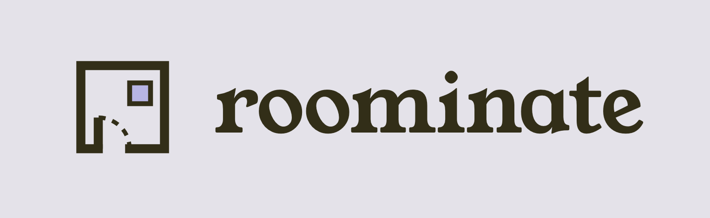

# Roominate

Roominate is a responsive, collaborative room-planning app that answers one question: **will the group cart fit the room, budget, housing rules, and everyone’s needs?**

It combines a measured React Three Fiber room editor with shared shopping, deterministic validation, optional OpenAI-assisted extraction, and an explained Better Cart.

## What it does

- Builds rectangular or traced non-rectangular rooms from confirmed dimensions and floor-plan screenshots.
- Researches a selected college, residence hall, and room type from official housing sources.
- Imports products by URL or screenshot and renders dimension-scaled procedural furniture.
- Supports drag, rotation, furniture snapping, locking, removal/undo, doors constrained to the perimeter, and beds lofted up to 60 inches.
- Manages roommate ownership, a shared cart, direct retailer links, budgets, rules, fit, clearance, and duplicate-purchase warnings.
- Generates collision-tested layouts and Better Cart changes with individual accept/reject controls.
- Provides expiring remote invitations with view/edit permissions and revision-safe explicit publishing.
- Includes resettable demo and Better Cart test rooms built from real IKEA/Amazon listings.

Room coordinates are consistent throughout: **X** is width, **Y** is floor-plane length, and **Z** is vertical. Furniture rotates around Z.

## Stack

- Next.js 16, React, and TypeScript
- React Three Fiber and Drei
- Python 3.12+ and FastAPI
- SQLite for AI caching, spend tracking, and development invite snapshots
- OpenAI Responses API with strict structured outputs
- Optional Amazon Creators API product discovery

## Run locally

Requirements: Node.js 20+, Python 3.12+, and Git.

```bash
npm install
npm run backend:setup
cp .env.example .env.local
npm run dev:all
```

Open [http://localhost:3000](http://localhost:3000). The API runs at [http://localhost:8000](http://localhost:8000).

Windows PowerShell users can create the environment file with:

```powershell
Copy-Item .env.example .env.local
```

`npm run backend:setup` creates `.venv` and installs backend dependencies. Playwright is optional for normal use but enables fallback reading of permitted JavaScript-rendered housing pages:

```bash
npx playwright install chromium
```

Servers can also run separately with `npm run backend:dev` and `npm run dev`. Use **Reset demo** in the app to restore the built-in rooms.

## Main workflows

### Room setup

Enter dimensions manually, research a school and dorm, or upload a floor plan. Browser code traces and scales the room outline; optional OpenAI vision reads only visible printed measurements and openings. Users choose which readings to apply, and imported evidence remains unconfirmed until reviewed.

Dorm research searches for likely official university sources, validates public URLs and `robots.txt`, cleans the pages, and sends only dimension-relevant sections for structured extraction. Static pages load concurrently with per-host throttling; recent pages and robots decisions are cached. Playwright runs only for the highest-ranked source when static fetching finds nothing usable. Users can also provide up to five official links directly.

Floor-plan and product uploads support HEIC/HEIF, JPEG, PNG, WebP, and GIF. HEIC/HEIF files are orientation-corrected and converted server-side. Uploads are limited to 8 MB each.

### 3D Studio

The measured room, traced walls, floor grid, doors, clearance zones, and furniture use real-world units. Items can be placed, dragged, rotated, snapped, locked, removed, and restored with undo. Doors can be added and dragged along the perimeter with their keep-clear areas. Beds can be lofted, allowing compatible furniture underneath.

The layout optimizer generates multiple candidates in code using room geometry, doors, windows, locked items, priorities, circulation, and furniture relationships. Every candidate must pass deterministic wall, ceiling, collision, and clearance checks. OpenAI may choose and explain one already-safe candidate; it cannot invent coordinates or bypass validation.

### Products and checkout

Product URL and screenshot imports extract reviewable names, dimensions, observed prices, and constrained procedural visual profiles. Generated visuals use renderer-supported primitives and never change confirmed dimensions or collision bounds.

The built-in catalog contains 59 IKEA/Amazon furnishings. Optional Amazon Creators API results are screened with the same code-based fit checks. Checkout groups items by retailer and links to individual product pages and retailer homepages; Roominate never collects payment information, mutates retailer carts, or places orders.

### Issues and Better Cart

Code—not the model—calculates collisions, room bounds, door clearance, subtotals, budget status, policy conflicts, and cross-roommate duplicates. Duplicate purchases can be reassigned, removed, or marked intentional.

Better Cart proposes validated moves, deferrals, and category-compatible product swaps. Users accept or reject every change and can undo application. OpenAI is used only to rewrite deterministic reasons into concise explanations.

### Remote collaboration

Choose **Share**, select view or edit access, expiry, and collaborator limit, then send the generated link. Collaborators explicitly refresh and publish; optimistic revisions prevent silent overwrites. Invite URLs are bearer secrets.

For remote users, deploy both services, set `NEXT_PUBLIC_API_URL` to the public HTTPS API, and include the web origin in `ALLOWED_ORIGINS`. Production should replace local SQLite/browser persistence with durable managed storage and account-based authorization.

## OpenAI usage and safety

OpenAI is optional. Without a key, manual room setup, 3D editing, product entry, validation, layout generation, and Better Cart remain usable through deterministic fallbacks.

OpenAI is used for:

- official dorm-source discovery and structured dimension extraction;
- reading printed floor-plan labels and openings;
- extracting product facts and simplified visual profiles from URLs or images;
- generating a supported visual style from a product name/category;
- choosing among already validated layout candidates; and
- explaining already validated Better Cart changes.

`OPENAI_API_KEY` stays on the FastAPI server. Calls use `/v1/responses`, strict JSON Schemas, Pydantic validation, bounded image/input sizes, and cached results. A SQLite ledger reserves estimated cost before each request, records actual token usage, enforces the per-project call limit, and blocks aggregate estimated spending at `$9` by default—leaving `$1` of a `$10` credit balance unused. Update the configured token rates when changing models.

## Environment variables

Copy `.env.example`; do not commit `.env.local`.

| Variable | Default | Purpose |
| --- | --- | --- |
| `NEXT_PUBLIC_API_URL` | `http://localhost:8000` | Browser-visible FastAPI origin; never contains a secret. |
| `OPENAI_API_KEY` | unset | Enables OpenAI features; server only. |
| `OPENAI_MODEL` | `gpt-4.1-mini` | Responses API model. |
| `OPENAI_IMAGE_DETAIL` | `low` | Default image detail; floor-plan labels use high detail. |
| `OPENAI_AGGREGATE_SPEND_GUARD_USD` | `9.00` | Aggregate preflight spending guard. |
| `OPENAI_MAX_CALLS_PER_PROJECT` | `30` | Per-project call limit; cache hits do not count. |
| `OPENAI_MAX_ESTIMATED_CALL_USD` | `0.08` | Amount reserved before a request. |
| `OPENAI_INPUT_COST_PER_1M` | `0.40` | Local input-token cost estimate. |
| `OPENAI_OUTPUT_COST_PER_1M` | `1.60` | Local output-token cost estimate. |
| `OPENAI_WEB_SEARCH_COST_USD` | `0.01` | Local hosted-search cost estimate. |
| `ROOMINATE_AI_DB` | `backend/data/ai_cache.sqlite` | Cache, usage ledger, and invite database. |
| `DORM_BROWSER_FALLBACK_ENABLED` | `true` | Enables guarded Playwright fallback. |
| `ALLOWED_ORIGINS` | localhost origins | Allowed frontend CORS origins. |
| `AMAZON_CREATORS_CREDENTIAL_ID` | unset | Optional Amazon Creators API credential ID. |
| `AMAZON_CREATORS_CREDENTIAL_SECRET` | unset | Optional Amazon Creators API secret. |
| `AMAZON_CREATORS_CREDENTIAL_VERSION` | `3.1` | Amazon credential version. |
| `AMAZON_ASSOCIATE_PARTNER_TAG` | unset | Amazon Associates partner tag. |
| `AMAZON_MARKETPLACE` | `www.amazon.com` | Amazon marketplace host. |

Shell environment variables take precedence over `.env` and `.env.local`.

## Tests

```bash
npm run typecheck
npm test
npm run backend:test
npm run build
npm run test:e2e
```

The seeded **Maple Hall · 214** demo exercises placement, budget, rule, duplicate, and clearance issues. **Better Cart test · Birch Attic 3B** exercises validated swaps, movement, deferral, priorities, and an under-budget final cart. Playwright covers the primary desktop, mobile, import, floor-plan, dorm-research, checkout, and collaboration flows.

## Current limitations

- Personal projects are browser-local; remote invite snapshots use SQLite and explicit refresh/publish rather than realtime synchronization.
- Small uploads may be retained as local data URLs. Production needs private object storage, signed access, and deletion jobs.
- Room scale comes from confirmed dimensions or a scaled floor plan—not photogrammetry or a LiDAR mesh.
- Floor plans must be raster images; PDFs require a screenshot.
- Product extraction depends on what the retailer permits the backend to read; blocked pages become editable manual drafts.
- Live stock, price, variant, shipping, tax, and delivery details must be reconfirmed with the retailer.
- Amazon live search requires accepted Associates/Creators API access. IKEA remains a browse/import workflow unless an approved integration is available.

Uncertain measurements, stale prices, missing dimensions, and undeployed collaboration are surfaced explicitly rather than presented as confirmed facts.
